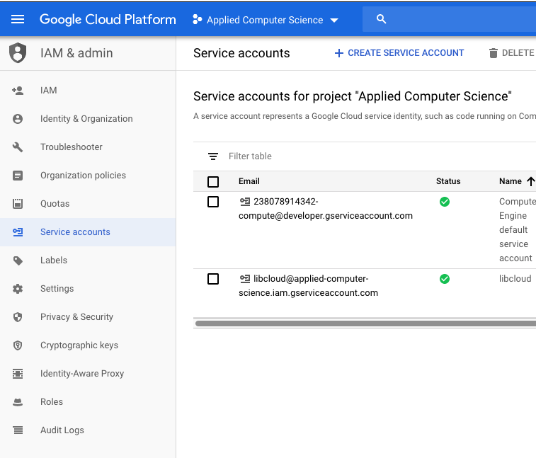
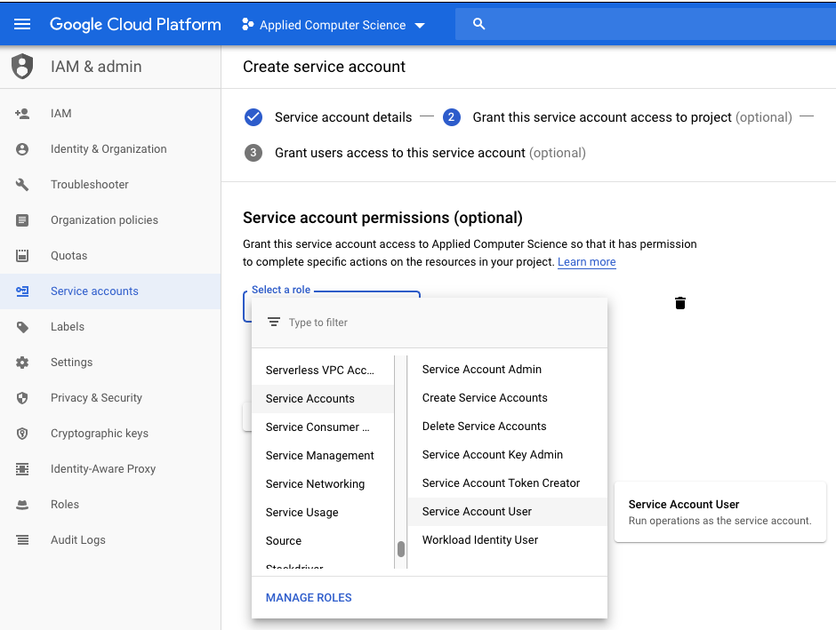
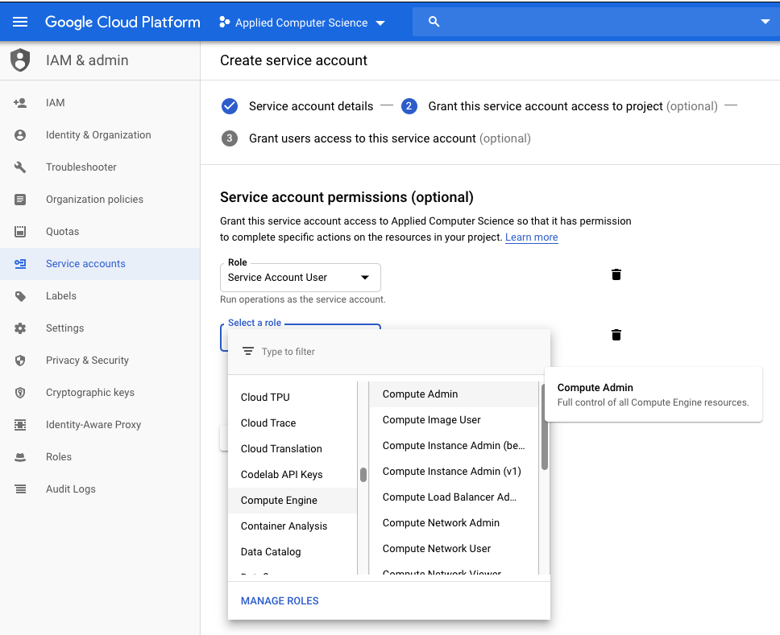
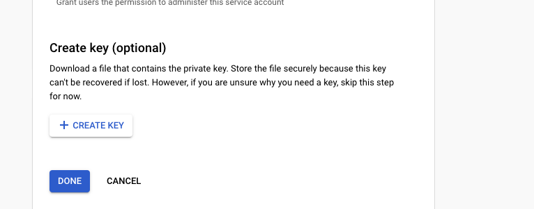

# Part3 - Creating 

In this task, you're going to create a program that run in the cloud
and still create virtual machines, just as in your first example.

In this case, the primary difference is that you're using a [service account](https://google-auth.readthedocs.io/en/latest/reference/google.oauth2.service_account.html#module-google.oauth2.service_account).
A service account is like a "password" that can be used to access your google cloud API without you having
to directly authenticate. Knowing how to use service accounts is important if you're
trying to create services that manage your cloud environment when you're not around.

The write up for the `google.auth` library above explains service accounts,
and there's also a writeup [the google cloud documentation](https://cloud.google.com/iam/docs/understanding-service-accounts).

Follow the steps below to create a service account and then save the resulting JSON credentials into a file
called `service-credentials.json`.

## Creating your service account

### Go to the Google Console IAM service

### Then create an account

### Then set it as a serviceAccountUser

### Then compute admin

### Then create the key and save the JSON file

